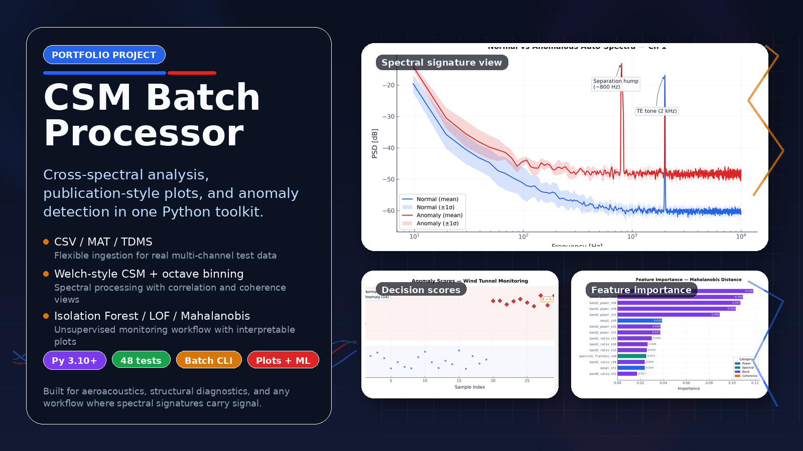
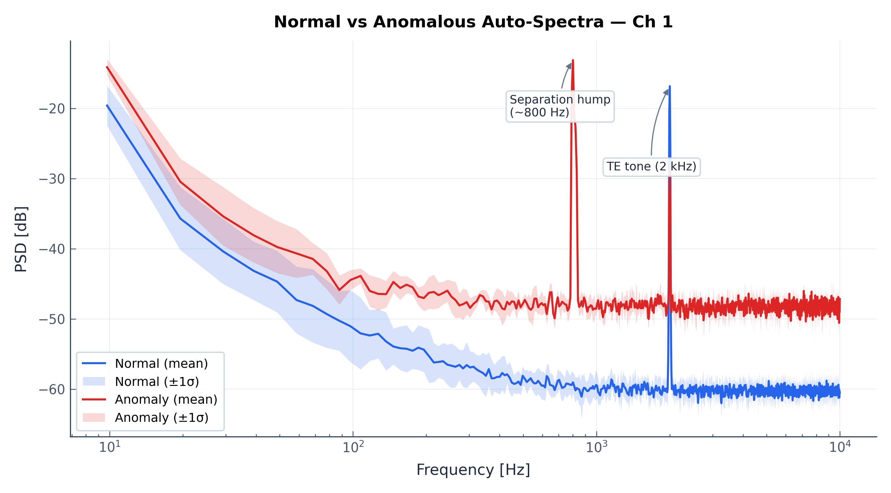
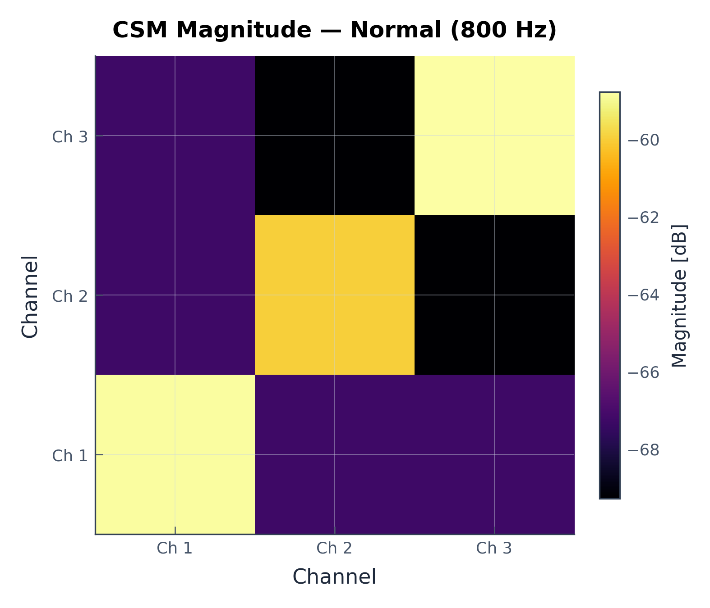
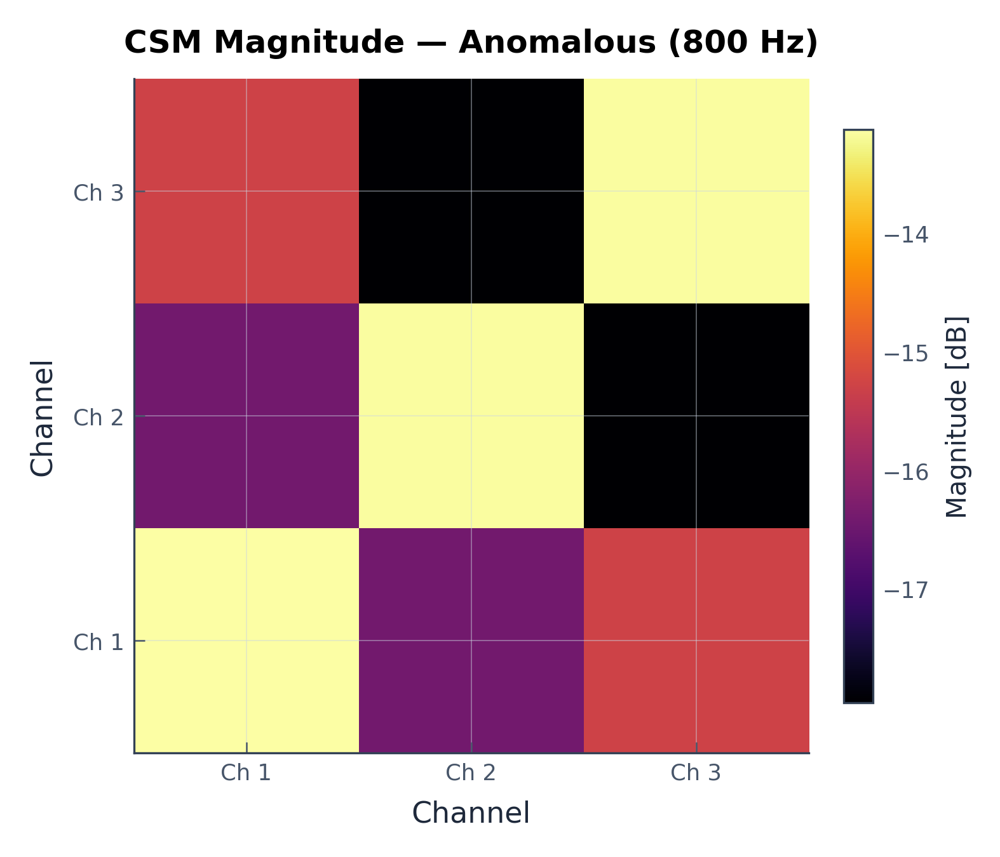
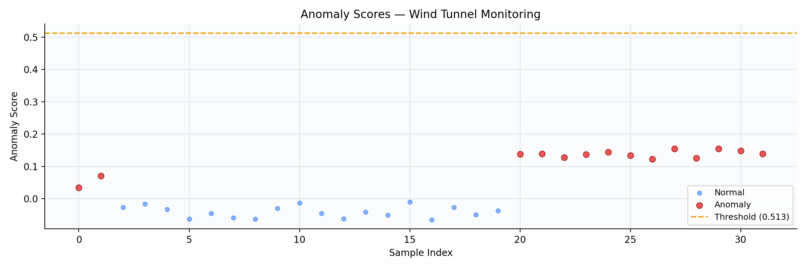
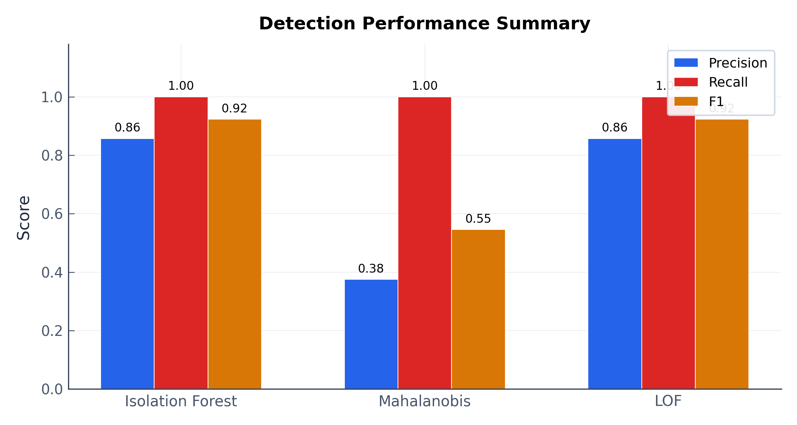

# CSM Batch Processor

[](https://github.com/4nechoic-hub/csm-batch-processor/actions/workflows/ci.yml)


[](4nechoic-hub.github.io/csm-batch-processor/)
Try the interactive browser demo: **[Live Demo](<4nechoic-hub.github.io/csm-batch-processor/>)**

Cross-spectral matrix toolkit for turning multichannel recordings into actionable monitoring signals.

CSM Batch Processor is a portfolio project built around a real signal-processing workflow: ingest multichannel CSV, MAT, or TDMS recordings, compute Welch-style cross-spectral matrices, extract spectral features, and flag off-nominal conditions with unsupervised anomaly detection. It is designed for aeroacoustics, structural monitoring, and other applications where changes in spectral structure matter.

## What this repo demonstrates

- **Reusable scientific Python package** for CSM computation, binning, correlation, plotting, and feature extraction
- **Batch CLI workflow** for repeatable one-file or many-file analysis
- **End-to-end anomaly pipeline** from spectral measurements to engineered features to unsupervised detection
- **Live demo:** use the Website link in the About box to try the browser demo.

This is not a notebook-only prototype. It is a packaged, testable workflow that combines signal processing, feature engineering, anomaly detection, and visualization in one coherent project.

## Features

- **Narrowband CSM** — Welch-style block-averaged cross-spectral matrix with configurable overlap and record length
- **Octave-band binning** — Fractional-octave binning such as 1/3-octave or 1/12-octave views
- **Correlation** — Normalised auto- and cross-correlation for all channel pairs
- **Feature extraction** — 63 spectral features per snapshot, including broadband statistics, band energies, and coherence-derived features
- **Anomaly detection** — Isolation Forest, Mahalanobis Distance, and Local Outlier Factor
- **Visualisation** — Publication-quality spectral, coherence, correlation, CSM-matrix, and anomaly plots
- **Multi-format I/O** — CSV, MATLAB `.mat` (v5-v7.3), and NI TDMS input support
- **Batch CLI** — Command-line processing for one file or many
- **Browser demo** — Standalone React/Vite demo in `web-demo/` for quick interactive exploration

## Installation

### Clone the repository

```bash
git clone https://github.com/4nechoic-hub/csm-batch-processor.git
cd csm-batch-processor
```

### Install the Python package

```bash
pip install -e .
```

Optional extras:

```bash
# With TDMS support
pip install -e ".[tdms]"

# With HDF5 / MAT v7.3 support
pip install -e ".[hdf5]"

# Everything
pip install -e ".[all]"
```

## Browser Demo

A standalone browser demo lives in `web-demo/`.

```bash
cd web-demo
npm install
npm run dev
```

This frontend is intentionally separate from the packaged Python library. It exists as a lightweight interactive showcase, while the main deliverable remains the Python signal-processing toolkit.

## Quick Start

```python
from csm_processor import csm_calculator, load_data, plot_autospectra

# Load multichannel data (CSV, MAT, or TDMS)
data = load_data("experiment_001.csv")

# Compute the cross-spectral matrix
spectra, freq = csm_calculator(data, fs=51200, n_rec=4096, overlap=50)

# Plot auto-spectra
fig = plot_autospectra(freq, spectra, title="Wind Tunnel Run 001")
fig.savefig("autospectra.png", dpi=200)
```

### Octave-band binning

```python
from csm_processor import bin_csm, log_freq_bin

# Bin a full CSM tensor
df = 51200 / 4096
freq_binned, spectra_binned = bin_csm(df, spectra, bins_per_octave=3)

# Or bin a single 1-D spectrum named psd
freq_binned, psd_binned = log_freq_bin(df, psd, bins_per_octave=3)
```

### Correlation

```python
from csm_processor import compute_correlation, plot_correlation

tau, corr_matrix = compute_correlation(data, fs=51200)
fig = plot_correlation(tau, corr_matrix)
```

### Coherence

```python
from csm_processor import plot_coherence

fig = plot_coherence(freq, spectra, ch_i=0, ch_j=1)
```

## Command-Line Interface

The primary installed command is `csm-processor`.

```bash
# Single file
csm-processor data.csv --fs 51200 --nrec 4096 --overlap 50 --plot

# Batch processing with binning, correlation, and plots
csm-processor *.tdms --fs 51200 --nrec 4096 \
  --bin --bpo 3 --correlation --plot --outdir results/

# Save MATLAB-compatible output
csm-processor data.csv --fs 51200 --nrec 4096 --fmt mat

# Alternate entry point
python -m csm_processor data.csv --fs 51200 --nrec 4096 --plot
```

Run `csm-processor --version` to check the installed version.

## Anomaly Detection

The anomaly pipeline turns raw spectral measurements into actionable monitoring outputs:

```text
Time-series -> CSM -> Feature Extraction -> Anomaly Detector -> Scores + Labels
```

### Typical workflow

```python
from csm_processor import (
    csm_calculator,
    load_data,
    extract_features_batch,
    SpectralAnomalyDetector,
    plot_anomaly_scores,
)

# 1. Build a baseline from known-normal recordings
baseline_csms = []
for file in normal_files:
    data = load_data(file)
    spectra, freq = csm_calculator(data, fs=51200, n_rec=4096, overlap=50)
    baseline_csms.append(spectra)

# 2. Extract features from baseline CSMs
X_train, feature_names = extract_features_batch(baseline_csms, freq, fs=51200)

# 3. Fit an unsupervised detector
detector = SpectralAnomalyDetector(method="isolation_forest", contamination=0.05)
detector.fit(X_train, feature_names=feature_names)

# 4. Score new measurements
X_test, _ = extract_features_batch(new_csms, freq, fs=51200)
result = detector.predict(X_test)

print(result.summary())
fig = plot_anomaly_scores(result)
```

### Detection methods

- **Isolation Forest** — good default for high-dimensional feature sets and mixed feature relevance
- **Mahalanobis Distance** — useful when you want an interpretable distance from a baseline centroid
- **Local Outlier Factor** — useful for local-density anomalies in non-Gaussian feature spaces

### Compare all methods

```python
from csm_processor import compare_methods

results = compare_methods(X_train, X_test, feature_names, contamination=0.05)
for method, result in results.items():
    print(f"{result.method}: {result.n_anomalies} anomalies detected")
```

## Demo Case Study

The included demo, `examples/anomaly_demo.py`, simulates a 3-microphone array monitoring flow over an airfoil.

- **Normal condition** — broadband turbulent boundary-layer noise with a trailing-edge tone at 2 kHz
- **Anomalous condition** — flow-separation signature with a hump near 800 Hz, elevated broadband energy, and reduced inter-channel coherence

This is a synthetic demo, but it tells a clear engineering story and produces useful visual diagnostics.

### Representative outputs

**Normal vs anomalous spectra**



**CSM magnitude comparison at 800 Hz**

| Normal | Anomalous |
| :---: | :---: |
|  |  |

**Anomaly scores**

On the included synthetic demo, Isolation Forest cleanly separates normal and anomalous snapshots and reaches 93.8% accuracy.



**Detection summary**

Isolation Forest and LOF achieve the strongest F1 score on the included demo.



Run the full demo locally:

```bash
python examples/anomaly_demo.py
```

## Project Structure

```text
assets/                 README assets, including the hero banner
csm_processor/          Python package
examples/               Demo scripts and generated example output
tests/                  Pytest suite
web-demo/               Standalone React/Vite frontend demo
README.md               Main project overview
pyproject.toml          Packaging and dependency metadata
```

## Package Architecture

```text
csm_processor/
├── __init__.py              # Public API with lazy plotting imports
├── __main__.py              # python -m entry point
├── cli.py                   # Batch CLI
├── csm_calculator.py        # Core CSM engine
├── log_binning.py           # Fractional-octave binning
├── correlation.py           # Auto/cross-correlation
├── feature_extraction.py    # ML-ready feature extraction
├── anomaly_detection.py     # Isolation Forest, Mahalanobis, LOF
├── anomaly_plotting.py      # Anomaly visualisation
├── io_utils.py              # CSV / MAT / TDMS loading and save helpers
├── plotting.py              # Spectral, correlation, coherence, and matrix plots
└── style.py                 # Shared plotting style helpers
```

## How the CSM Computation Works

The core algorithm follows the standard Welch-style pattern:

1. Segment the multichannel time series into overlapping blocks of length `n_rec`
2. Apply a periodic Hanning window to each block
3. Compute the FFT for each channel and block
4. Form the outer product at each frequency, `CSM[f, i, j] = S[f, i] * conj(S[f, j])`
5. Average over blocks and normalise by sampling rate, record length, and number of blocks

This produces a complex Hermitian cross-spectral matrix for each frequency bin.

## Output Format

Results are saved as `.npz` by default, or `.mat` if requested.

Saved outputs can include:

- `spectra` — cross-spectral matrix with shape `(N_freq, M, M)`
- `freq` — frequency vector with shape `(N_freq,)`
- `fs`, `n_rec`, `overlap` — processing parameters
- `freq_binned`, `spectra_binned` — optional octave-binned outputs
- `tau`, `corr_matrix` — optional correlation-domain outputs

## Testing

```bash
pytest tests/ -v
```

The test suite covers:

- CSM computation and shape/consistency checks
- octave-band binning and correlation utilities
- feature extraction and anomaly detection behavior
- CLI behavior and metadata/version consistency
- import-side-effect regressions
- I/O and edge cases

GitHub Actions runs the suite across Python 3.10-3.13.

## Why this is a good portfolio project

This repo demonstrates more than numerical correctness. It shows:

- scientific Python engineering, not just notebook experimentation
- attention to package boundaries and public API design
- CLI usability and reproducible workflows
- interpretation-oriented plotting, not only raw computation
- a full path from signal processing to ML-based monitoring
- presentation polish through a dedicated browser demo and README assets

## License

MIT

Built by Tingyi Zhang as a portfolio project focused on signal processing, scientific Python, and engineering-oriented machine learning.
