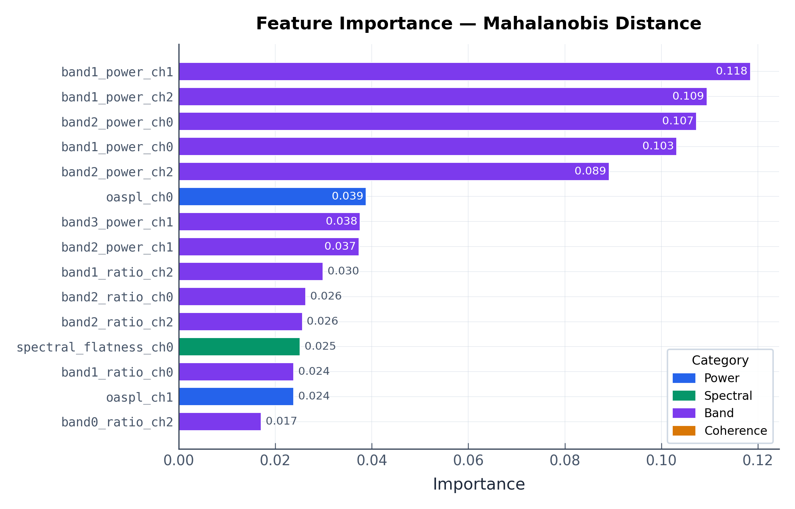
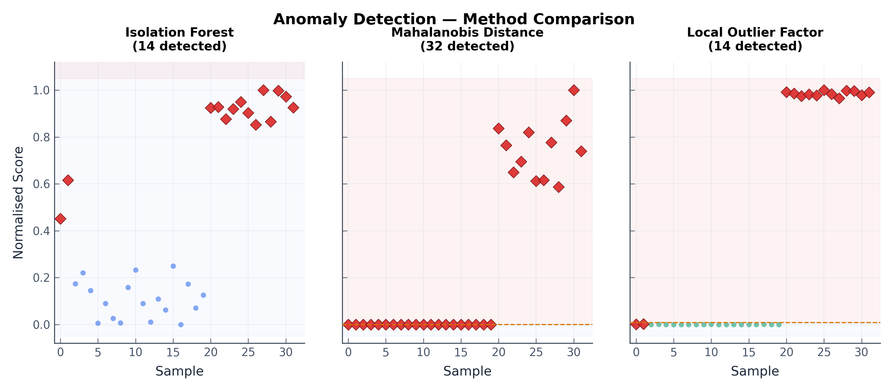

# CSM Batch Processor — Python Edition

[](https://github.com/4nechoic-hub/csm-batch-processor/actions/workflows/ci.yml)


**Cross-Spectral Matrix calculator and spectral analysis toolkit with ML-based anomaly detection**, ported from MATLAB App Designer.

Computes narrowband cross-spectral matrices from multi-channel time-series data using Welch's block-averaging method with Hanning windowing. Includes a feature extraction and unsupervised anomaly detection pipeline for spectral monitoring applications.

---

## Features

| Feature | Description |
|---|---|
| **Narrowband CSM** | Welch-style block-averaged cross-spectral matrix with configurable overlap and record length |
| **Octave-band binning** | Fractional-octave frequency binning (1/3, 1/12, etc.) via `logfnan` algorithm |
| **Correlation** | Normalised auto- and cross-correlation for all channel pairs |
| **Feature extraction** | 63 ML-ready spectral features per snapshot (broadband stats, band energies, coherence) |
| **Anomaly detection** | Unsupervised detection via Isolation Forest, Mahalanobis distance, and Local Outlier Factor |
| **Visualisation** | Publication-quality spectral, coherence, correlation, and anomaly plots |
| **Multi-format I/O** | Reads CSV, MATLAB `.mat` (v5–v7.3), and NI TDMS files |
| **Batch CLI** | Process multiple files from the command line |
| **React GUI** | Interactive browser-based demo for quick analysis |

## Installation

```bash
pip install -e .

# With TDMS support
pip install -e ".[tdms]"

# Everything
pip install -e ".[all]"
```

## Quick Start — Python API

```python
import numpy as np
from csm_processor import csm_calculator, load_data, plot_autospectra

# Load data (CSV, MAT, or TDMS)
data = load_data("experiment_001.csv")

# Compute cross-spectral matrix
spectra, freq = csm_calculator(data, fs=51200, n_rec=4096, overlap=50)

# Plot auto-spectra
fig = plot_autospectra(freq, spectra, title="Wind Tunnel Run 001")
fig.savefig("autospectra.png", dpi=200)
```

### Octave-Band Binning

```python
from csm_processor.log_binning import bin_csm

df = 51200 / 4096  # = 12.5 Hz
freq_binned, spectra_binned = bin_csm(df, spectra, bins_per_octave=3)
```

### Correlation

```python
from csm_processor import compute_correlation, plot_correlation

tau, corr_matrix = compute_correlation(data, fs=51200)
fig = plot_correlation(tau, corr_matrix)
```

### Coherence

```python
from csm_processor import plot_coherence

fig = plot_coherence(freq, spectra, ch_i=0, ch_j=1)
```

---

## Anomaly Detection

The anomaly detection pipeline turns raw CSM outputs into actionable monitoring insights. It's designed for scenarios like wind tunnel testing, structural health monitoring, or any application where changes in spectral signatures indicate off-nominal conditions.

### Pipeline Overview

```
Time-series data → CSM → Feature Extraction (63 features) → Anomaly Detector → Scores + Labels
```

### Usage

```python
from csm_processor import (
    csm_calculator, extract_features_batch,
    SpectralAnomalyDetector, plot_anomaly_scores,
)

# 1. Compute CSMs for your baseline (normal) data
baseline_csms = []
for file in normal_files:
    data = load_data(file)
    spectra, freq = csm_calculator(data, fs=51200, n_rec=4096, overlap=50)
    baseline_csms.append(spectra)

# 2. Extract features
X_train, feature_names = extract_features_batch(baseline_csms, freq, fs=51200)

# 3. Fit detector on baseline
detector = SpectralAnomalyDetector(method="isolation_forest", contamination=0.05)
detector.fit(X_train, feature_names=feature_names)

# 4. Score new measurements
X_test, _ = extract_features_batch(new_csms, freq, fs=51200)
result = detector.predict(X_test)

print(result.summary())
fig = plot_anomaly_scores(result)
```

### Detection Methods

| Method | Best for | How it works |
|---|---|---|
| **Isolation Forest** | General-purpose, high-dimensional features | Tree-based isolation of outliers; robust to irrelevant features |
| **Mahalanobis Distance** | Gaussian-distributed features, interpretable thresholds | Parametric distance from baseline centroid; provides per-feature importance |
| **Local Outlier Factor** | Non-Gaussian distributions, local density variations | Density-based; catches anomalies in locally sparse regions |

### Compare All Methods

```python
from csm_processor import compare_methods

results = compare_methods(X_train, X_test, feature_names, contamination=0.05)
for method, result in results.items():
    print(f"{result.method}: {result.n_anomalies} anomalies detected")
```

### Demo Results

The included demo (`examples/anomaly_demo.py`) simulates a 3-microphone array monitoring flow over an airfoil. Normal conditions produce broadband turbulent boundary layer noise with a tonal trailing edge peak at 2 kHz. Anomalous conditions (flow separation) introduce a spectral hump at 800 Hz, elevated broadband levels, and loss of inter-channel coherence.

**Normal vs anomalous spectra** — the spectral signature change is clearly visible:


**Anomaly scores** — Isolation Forest cleanly separates normal from anomalous snapshots (93.8% accuracy):


**Feature importance** — band energy features dominate, consistent with the broadband energy shift during flow separation:



**Method comparison** — all three detectors side by side:



Run it yourself:

```bash
python examples/anomaly_demo.py
```

### Extracted Features (63 per snapshot)

**Per-channel (×M channels):** total power, OASPL, peak frequency, peak PSD, spectral centroid, bandwidth, slope, flatness, crest factor, kurtosis, 4× band energies, 4× band ratios.

**Cross-channel (×M(M-1)/2 pairs):** mean coherence, peak coherence, coherence-weighted phase.

---

## Command-Line Interface

```bash
# Single file
python -m csm_processor data.csv --fs 51200 --nrec 4096 --overlap 50 --plot

# Batch with binning
python -m csm_processor *.tdms --fs 51200 --nrec 4096 \
    --bin --bpo 3 --correlation --plot --outdir results/

# Save as .mat (MATLAB-compatible)
python -m csm_processor data.csv --fs 51200 --nrec 4096 --fmt mat
```

## Architecture

```
csm_processor/
├── __init__.py              # Public API
├── __main__.py              # python -m entry
├── cli.py                   # Batch CLI
├── csm_calculator.py        # Core CSM engine (port of CSM_Calculator.m)
├── log_binning.py           # Fractional-octave binning (port of logfnan.m)
├── correlation.py           # Auto/cross-correlation
├── feature_extraction.py    # ML-ready spectral feature extraction
├── anomaly_detection.py     # Unsupervised anomaly detection (IF, Mahalanobis, LOF)
├── anomaly_plotting.py      # Anomaly visualisation
├── io_utils.py              # CSV / MAT / TDMS loaders + save helpers
└── plotting.py              # Matplotlib visualisation
```

### CSM Computation — How It Works

The algorithm follows Welch's method:

1. **Segment** the time-series into overlapping blocks of length `n_rec`
2. **Window** each block with a periodic Hanning window (energy-normalised by √0.375)
3. **FFT** each windowed block per channel
4. **Outer product** at each frequency: `CSM[f,i,j] = S[f,i] × conj(S[f,j])`
5. **Average** across all blocks and normalise: `CSM = 2·Σ / (n_rec · fs · n_blocks)`

This is a direct port of the original MATLAB `CSM_Calculator.m` function.

## Input Parameters

| Python|
|---|
| `csm_calculator(data, fs, n_rec, overlap)` |
| `log_freq_bin(df, spectrum, bins_per_octave)` |
| `compute_correlation(data, fs)` |
| `spectra[:, i, j]` |

## Testing

```bash
pytest tests/ -v
```

43 tests covering CSM computation, feature extraction, anomaly detection, I/O, and edge cases. CI runs automatically on every push via GitHub Actions across Python 3.10–3.13.

## Output Format

Results are saved as `.npz` (default) or `.mat` files containing:

- `spectra` — Cross-spectral matrix `(N_freq × M × M)`
- `freq` — Frequency vector `(N_freq,)`
- `fs`, `n_rec`, `overlap` — Processing parameters
- `freq_binned`, `spectra_binned` — (if `--bin` used)
- `tau`, `corr_matrix` — (if `--correlation` used)

## License

MIT

This project is released for portfolio and educational purposes by Tingyi Zhang.